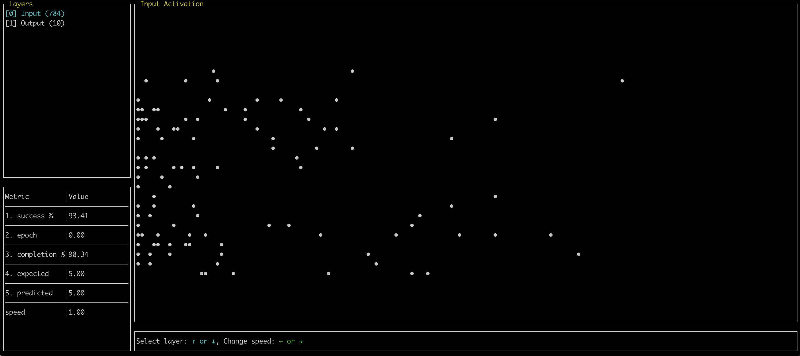

# Spiky

This repository trains a spiking neural network on MNIST dataset. A simple perceptron architecture achieves ~90% success rate on training set after few epochs.

## Training

**Encoding** : Pixels are encoded using latency encoding (Time to First Spike) : $ TimeToSpike = -log\left(\frac{value}{max\_value}\right) $

**Decoding** : The first neuron to spike is used as the label for the image.

**Updates** : The weights are updated using the time difference between the value expected and predicted

## Reporting 

You can preview the models activations and metrics while training the model. The activation graph represents the timing at which the neurons in a layer fires. Y-axis = Neuron index. X-Axis = Time.

Using the arrows of your keyboard you can adjust the speed of the training and select the layer to inspect.



## Running in Docker

```shell
docker run -it huguespouillot/spiky
```